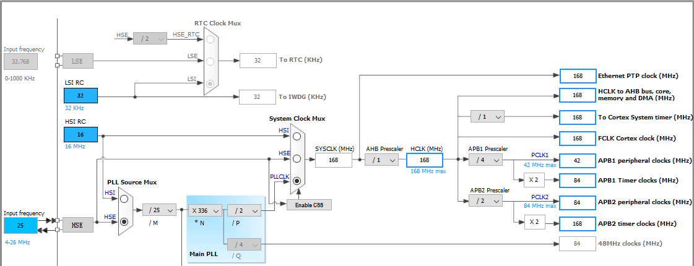

# 嵌入式智能车底层代码

## 作者

[@gjs990825](https://github.com/gjs990825) on github  
E-mail:<GJS990825@GMAIL.COM>

***

## 平台

### IDE

    MDK-ARM

### 微控制器

    STM32F407IGT6

### 硬件平台

    2018年嵌入式小车

***

## 通信协议

详见[./APP/Protocol/protocol.h](./APP/Protocol/protocol.h)文件

***

## 时钟配置信息

***

## 定时器配置信息

| 总线 | 时钟（MHz） | TIMx  | 功能                 | Period | Prescaler | 定时时间（ms） |
|:----:|:-----------:|:-----:|----------------------|:------:|:---------:|:--------------:|
| APB1 |     168     | TIM1  | -                    |   -    |     -     |    #VALUE!     |
| APB2 |     84      | TIM2  | -                    |   -    |     -     |    #VALUE!     |
| APB2 |     84      | TIM3  | ZigBee/WIFI 数据检查 |  167   |   1999    |       4        |
| APB2 |     84      | TIM4  | 数据通道（未启用）   |   -    |     -     |    #VALUE!     |
| APB2 |     84      | TIM5  | Debug（白卡检测）    | 16799  |   1999    |      400       |
| APB2 |     84      | TIM6  | 超声波（计时）       |   9    |    83     |      0.01      |
| APB2 |     84      | TIM7  | CAN总线收发检测      |   83   |    999    |       1        |
| APB1 |     168     | TIM8  | -                    |   -    |     -     |    #VALUE!     |
| APB1 |     168     | TIM9  | 路况检测             |  167   |   1999    |       2        |
| APB1 |     168     | TIM10 | 全局时间             |  167   |    999    |       1        |
| APB1 |     168     | TIM11 | -                    |   -    |     -     |    #VALUE!     |
| APB2 |     84      | TIM12 | -                    |   -    |     -     |    #VALUE!     |
| APB2 |     84      | TIM13 | -                    |   -    |     -     |    #VALUE!     |
| APB2 |     84      | TIM14 | -                    |   -    |     -     |    #VALUE!     |

***

## 中断配置

### 中断分组

`NVIC_PriorityGroup_2`

### 中断优先级配置

| 响应顺序 | 中断号                    | 功能                | 抢占 | 响应 |
|:--------:|---------------------------|---------------------|:----:|:----:|
|    0     | TIM7_IRQn                 | CAN总线收发检测     |  0   |  0   |
|    1     | TIM1_BRK_TIM9_IRQn(TIM9)  | 路况监测            |  0   |  1   |
|    2     | TIM1_UP_TIM10_IRQn(TIM10) | 全局时间            |  0   |  2   |
|    3     | UART4_IRQn                | A72 串口            |  1   |  0   |
|    4     | UART2_IRQn                | WIFI 串口           |  1   |  1   |
|    5     | USART6_IRQn               | 语音模块            |  1   |  2   |
|    6     | TIM6_DAC_IRQn(TIM6)       | 超声波（时间测量）  |  2   |  0   |
|    7     | EXTI4_IRQn(PB4)           | 超声波（触发）      |  2   |  1   |
|    8     | TIM3_IRQn                 | ZigBee/WIFI数据检查 |  2   |  2   |
|    9     | TIM5_IRQn                 | Debug（白卡检测）   |  3   |  0   |
|    10    | UART1_IRQn                | 未使用              |  -   |  -   |
|    11    | TIM4_IRQn                 | 数据通道（未使用）  |  -   |  -   |

***

## CAN总线节点数据上传间隔

| 节点     | 间隔时间（ms） |
|----------|----------------|
| 循迹信息 | 20             |
| 码盘值   | 100            |
| WIFI     | 有数据时上传   |
| ZigBee   | 有数据时上传   |

***

## ZigBee信道分配

| 信道编号 | 对应设备     |
|----------|--------------|
| 1        | 主车         |
| 2        | AGV运输车    |
| 3        | 道闸         |
| 4        | LED显示      |
| 5        | 立体车库B    |
| 6        | 语音播报     |
| 7        | 红外报警器   |
| 8        | TFT显示B     |
| 9        | 自动调光     |
| 10(A)    | 无线充电     |
| 11(B)    | TFT显示A     |
| 12(C)    | ETC系统      |
| 13(D)    | 立体车库A    |
| 14(E)    | 交通灯A      |
| 15(F)    | 交通灯B      |
| 175(AF)  | 自动评分系统 |

***

## 通用控制板的拨码开关

注意：通用控制板的拨码开关是反的。ON代表0，OFF是1。  

| 对应标志物 | 拨码开关 |
|:-----------|:--------:|
| LED显示    |   0111   |
| 报警系统   |   1011   |
| 交通灯     |   1101   |
| 调光       |   1110   |
| ETC系统    |   0011   |
| 道闸系统   |   0101   |
| 无线充电   |   0110   |

***

## Attention

基本所有的数据发送缓冲都是50字节，不要超出这个数值  

文件编码除了voice.c为GB3212之外其它全部为UTF-8，因为SYN7318的语音合成使用的字符格式为GB2312  

连接模式可以通过复位后的按键来改变，也可以直接定死。  
从车通讯显示板的HEX文件和主车不通用。  
官方代码里面很多坑，觉得就问题就试着分析一下，有能力就重构，能力不够就避开。

核心板的HEX烧录文件是坏掉的，需要用旧版。
旋转LED新的HEX文件时钟对不上，需要用旧版。  
通用控制板的拨码开关对应相应的功能，功能不对时候对一下上面的表↑

***

## 其它

定时器、中断优先级的配置和任务板引脚统计信息
在[./Doc/Configurations.xlsx](./Doc/Configurations.xlsx)中查看  
ASCII字符对照详见：[ASCII码对照表](./Doc/ASCII_Table.md)  